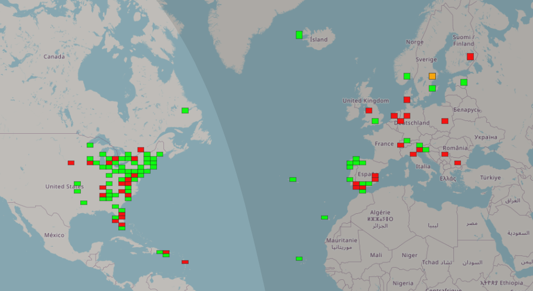

# mqtt2gridtracker

A small script that pulls reports from http://mqtt.pskreporter.info/, subscribes to spots to/from your call, prints them on the console and finally send them to an instance of Gridtracker (https://gridtracker.org/).

Screenshot from Gridtracker

## Installation

### Install paho-mqtt

	pip install paho-mqtt

### Replace MYCALL, ip-address & port

Edit mqtt2gridtracker.py

    mycall = "MYCALL"
    myloc = "XXYY"
    host = "192.168.1.300"
    port = 2237

### Control 

Show received by other calls 

     showrec = True

Show received by you call

     showmyrec = True

### Run and hopefully enjoy!

    python3 ./mqtt2gridtracker.py

## Licence

 This program is free software: you can redistribute it and/or modify
 it under the terms of the GNU General Public License as published by
 the Free Software Foundation, either version 2 of the License, or
 (at your option) any later version.

 This program is distributed in the hope that it will be useful,
 but WITHOUT ANY WARRANTY; without even the implied warranty of
 MERCHANTABILITY or FITNESS FOR A PARTICULAR PURPOSE.  See the
 GNU General Public License for more details.

  You should have received a copy of the GNU General Public License
  along with this program.  If not, see <http://www.gnu.org/licenses/>.
